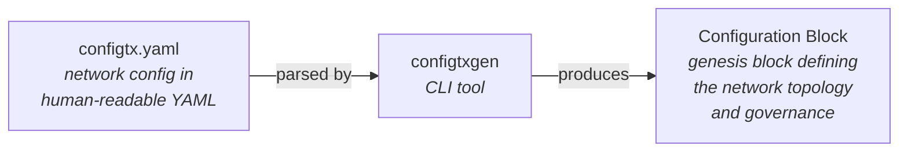
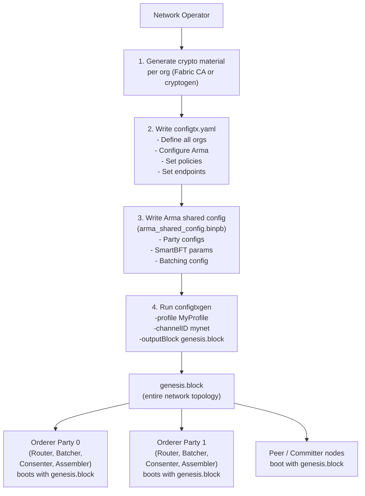
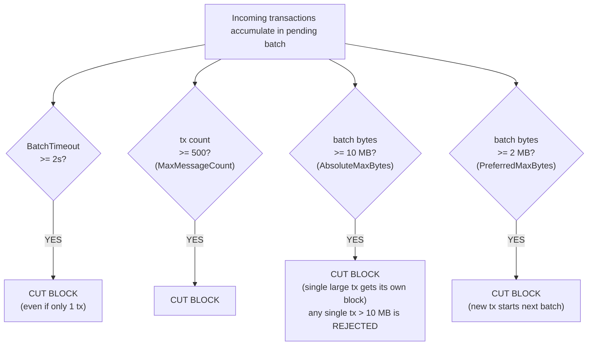
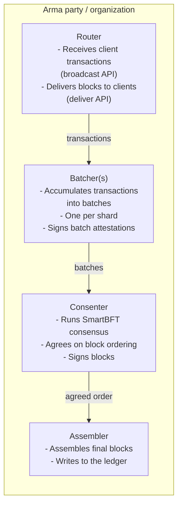
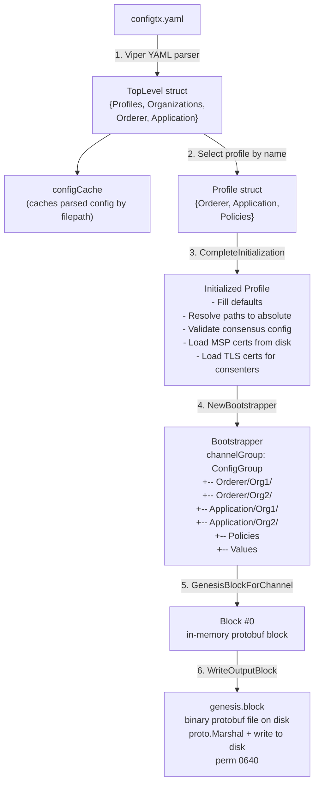

# Network Governance with the Configuration Block

## Table of Contents

1. [Overview](#1-overview)
2. [What is configtx.yaml?](#2-what-is-configtxyaml)
3. [What is configtxgen?](#3-what-is-configtxgen)
4. [The Big Picture: From YAML to Running Network](#4-the-big-picture-from-yaml-to-running-network)
5. [configtx.yaml Section-by-Section Reference](#5-configtxyaml-section-by-section-reference)
   - [Organizations](#51-organizations)
   - [Capabilities](#52-capabilities)
   - [Application](#53-application)
   - [Orderer](#54-orderer)
   - [Channel](#55-channel)
   - [Profiles](#56-profiles)
6. [Arma Consensus: The Fabric-X Ordering Architecture](#6-arma-consensus-the-fabric-x-ordering-architecture)
7. [Orderer Endpoints with Party IDs and Separated APIs](#7-orderer-endpoints-with-party-ids-and-separated-apis)
8. [Policies Deep Dive](#8-policies-deep-dive)
9. [How configtxgen Generates the Genesis Block](#9-how-configtxgen-generates-the-genesis-block)
10. [Genesis Block Internal Structure](#10-genesis-block-internal-structure)
11. [The Network Configuration Hierarchy](#11-the-network-configuration-hierarchy)
12. [Step-by-Step Usage Examples](#12-step-by-step-usage-examples)

---

## 1. Overview

In Fabric-X, the **configuration block** (the genesis block) is the
foundational artifact that creates the blockchain network and establishes its
governance. It defines who participates, which identities are trusted, how
ordering works, and which policies control administrative and transaction
actions. Every node in the network boots from the same configuration block,
ensuring all parties share an identical starting point for trust and governance.

After the network starts, configuration changes are themselves governed by the
policies encoded in the block. Updating an MSP root, adding an organization,
or changing an endorsement policy requires authorized signatures. This keeps
operational changes auditable and prevents unilateral changes by a single
participant unless policy explicitly permits it.

Two key pieces work together to produce the configuration block:



- **configtx.yaml** -- Defines all organizations, their endpoints, the ordering
  service configuration, and access policies.
- **configtxgen** -- Reads configtx.yaml and produces a binary configuration
  block (genesis block) that bootstraps every node in the Fabric-X network.

Throughout this document, **peer** and **committer** are used interchangeably
when discussing the application side of the network. A peer represents the node
stack that includes endorsement and commit functionality; in Fabric-X this maps
to the endorser-facing and committer-facing components that consume the same
network configuration.

---

## 2. What is configtx.yaml?

`configtx.yaml` is the single source of truth for the Fabric-X network
configuration. It contains **six top-level sections**:

```
configtx.yaml
|
+-- Organizations       Who participates in the network
|                       (MSP identity, policies, orderer endpoints)
|
+-- Capabilities        Feature gates for binary compatibility
|                       (will be used for rolling upgrades in future versions)
|
+-- Application         Configuration for the peer/committer side
|                       (policies, lifecycle endorsement)
|
+-- Orderer             Configuration for the ordering service
|                       (Arma consensus, batch parameters, consenters)
|
+-- Channel             Top-level network policies
|
+-- Profiles            Named configurations that combine the above
|                       (this is what configtxgen reads)
```

YAML anchors (`&name`) and merge keys (`<<: *name`) are used extensively
to define reusable templates in the top-level sections and reference them
in Profiles. An anchor gives a YAML block a name, and a merge key copies that
named block into another location.

For example, `Application: &ApplicationDefaults` creates a reusable
`ApplicationDefaults` template. Later, `<<: *ApplicationDefaults` means "copy
all fields from that template here, then let any fields below override copied
values." This keeps profiles short while still producing one fully expanded
configuration for `configtxgen` to process.

---

## 3. What is configtxgen?

`configtxgen` is the CLI tool that transforms configtx.yaml into a binary
genesis block. Operators run it after crypto material and Arma metadata are
ready, and before starting any orderer, peer, or committer component.

The tool does not create identities or run the network. Its job is to parse the
YAML, resolve anchors and merge keys, load public certificates from MSP
directories, embed consensus metadata, and serialize the resulting network
governance configuration into a protobuf block.

```
+------------------------------------------------------------------+
|                        configtxgen                               |
|                                                                  |
|  Inputs:                                                         |
|    - configtx.yaml (via -configPath or FABRIC_CFG_PATH env var) |
|    - A profile name (-profile)                                   |
|    - A network/channel ID (-channelID)                           |
|                                                                  |
|  Primary output:                                                 |
|    - Genesis block (-outputBlock)                                |
|                                                                  |
|  Utility outputs:                                                |
|    - Inspect a block as JSON (-inspectBlock)                     |
|    - Print an org definition as JSON (-printOrg)                 |
+------------------------------------------------------------------+
```

---

## 4. The Big Picture: From YAML to Running Network

A Fabric-X network starts from several inputs that must agree with each other.
MSP directories define organizational trust roots and signing identities.
`configtx.yaml` describes which organizations participate, which policies govern
them, and which endpoints clients and nodes use. Arma metadata describes the
ordering-service topology that those organizations will run.

The Arma shared configuration file (`arma_shared_config.binpb`) is generated by
the `armageddon` CLI tool in the `fabric-x-orderer` repository. Deployment
operators use `armageddon generate` to create orderer node configs and the shared
binary protobuf metadata. `configtxgen` then embeds that metadata by reading the
path configured under `Orderer.Arma.Path`.

After `configtxgen` writes the genesis block, every node receives the same file.
That shared block is what lets routers, batchers, consenters, assemblers,
peers, and committers agree on the initial network membership, trust anchors,
policies, and ordering configuration.



---

## 5. configtx.yaml Section-by-Section Reference

### 5.1 Organizations

The `Organizations` section defines every participant in the network. In
Fabric-X, organizations can participate in either the ordering service, the
application layer, or both.

```yaml
Organizations:
  - &SampleOrg
    Name: SampleOrg                   # Config group key (alphanumeric, dots, dashes)
    ID: SampleOrg                     # MSP identifier (used in policy rules)
    MSPDir: crypto/SampleOrg/msp      # Path to MSP directory
    SkipAsForeign: false              # Must be false for genesis block generation
    Policies: &SampleOrgPolicies      # Anchor for reuse in dev-mode profiles
      Readers:
        Type: Signature
        Rule: OR('SampleOrg.member')
      Writers:
        Type: Signature
        Rule: OR('SampleOrg.member')
      Admins:
        Type: Signature
        Rule: OR('SampleOrg.admin')
      Endorsement:
        Type: Signature
        Rule: OR('SampleOrg.member')
    OrdererEndpoints:                 # Simple default (legacy format)
      - localhost:7050

  - &Org1
    Name: Org1
    ID: Org1
    MSPDir: crypto/Org1/msp
    SkipAsForeign: false
    Policies:
      Readers:
        Type: Signature
        Rule: OR('Org1.member')
      Writers:
        Type: Signature
        Rule: OR('Org1.member')
      Admins:
        Type: Signature
        Rule: OR('Org1.admin')
      Endorsement:
        Type: Signature
        Rule: OR('Org1.member')
    OrdererEndpoints:
      - localhost:7050

  - &Org2
    Name: Org2
    ID: Org2
    MSPDir: crypto/Org2/msp
    SkipAsForeign: false
    Policies:
      Readers:
        Type: Signature
        Rule: OR('Org2.member')
      Writers:
        Type: Signature
        Rule: OR('Org2.member')
      Admins:
        Type: Signature
        Rule: OR('Org2.admin')
      Endorsement:
        Type: Signature
        Rule: OR('Org2.member')
    OrdererEndpoints:
      - localhost:7050
```

> **Note:** The base org definition typically uses a simple `host:port` endpoint.
> In Fabric-X profiles, the `OrdererEndpoints` are **overridden** with the
> richer format that includes party IDs and separated broadcast/deliver APIs
> (see [Section 7](#7-orderer-endpoints-with-party-ids-and-separated-apis)).
> For example, a profile may override the endpoints as:

```yaml
- <<: *Org1
  OrdererEndpoints:
    - id=0,broadcast,orderer-1:7050
    - id=0,deliver,orderer-1:7060
```

**Anatomy of an Organization:**

```
Organization
|
+-- Name                 Config group key. Must be unique across all orgs.
+-- ID                   MSP ID. Referenced in policy rules: OR('ID.member')
+-- MSPDir               Filesystem path to MSP directory (resolved relative
|                        to configtx.yaml location)
+-- MSPType              Provider type. Defaults to "FABRIC" (BCCSP-based).
+-- SkipAsForeign        Must be false for genesis block generation.
+-- AdminPrincipal       Deprecated. Defaults to "Role.ADMIN".
|
+-- Policies             Per-org access control policies
|   +-- Readers          Who can query this org's data
|   +-- Writers          Who can submit transactions for this org
|   +-- Admins           Who can perform admin operations for this org
|   +-- Endorsement      Who can endorse transactions for this org
|
+-- OrdererEndpoints     Fabric-X endpoints with party IDs and API separation
|                        (see Section 7 for full format reference)
|
+-- AnchorPeers          Optional: gossip peer discovery hints
    +-- Host             Anchor peer hostname
    +-- Port             Anchor peer port
```

**MSP Directory Structure:**

The MSPDir must contain the organization's cryptographic material:

```
MSPDir/
+-- cacerts/                 Root CA certificates (trust anchors)
|   +-- ca-cert.pem
+-- admincerts/              Admin identity certificates
|   +-- Admin-cert.pem       (optional if NodeOUs are enabled)
+-- knowncerts/              Known identity certificates
|   +-- User1@Org-cert.pem   (pre-registered user certificates)
+-- signcerts/               Signing identity certificate
|   +-- cert.pem
+-- keystore/                Private keys (NOT included in genesis block)
|   +-- key.pem
+-- tlscacerts/              TLS root CA certificates
|   +-- tlsca-cert.pem
+-- config.yaml              NodeOU configuration (optional)
```

> **Important:** The `keystore/` directory contains private keys and is
> **never embedded** in the genesis block. Only public certificates from
> `cacerts/`, `admincerts/`, `knowncerts/`, `signcerts/`, and `tlscacerts/`
> are included.

---

### 5.2 Capabilities

Capabilities will be used in a future version to support rolling upgrades of
committer and orderer nodes. The current sampleconfig keeps the capability maps
empty:

```yaml
Capabilities:
  Channel: &ChannelCapabilities {}
  Orderer: &OrdererCapabilities {}
  Application: &ApplicationCapabilities {}
```

---

### 5.3 Application

The `Application` section configures the peer and committer side of the
network. It defines policies, including the lifecycle endorsement
policy used for namespace creation.

```yaml
Application: &ApplicationDefaults
  Organizations:

  Policies:
    LifecycleEndorsement:
      Type: ImplicitMeta
      Rule: MAJORITY Endorsement
    Endorsement:
      Type: ImplicitMeta
      Rule: MAJORITY Endorsement
    Readers:
      Type: ImplicitMeta
      Rule: ANY Readers
    Writers:
      Type: ImplicitMeta
      Rule: ANY Writers
    Admins:
      Type: ImplicitMeta
      Rule: MAJORITY Admins

  Capabilities:
    <<: *ApplicationCapabilities
```

**Namespace Creation via Lifecycle Endorsement Policy:**

Fabric-X uses application namespaces to isolate different workloads. New
namespaces are created through the **lifecycle endorsement policy**
(`LifecycleEndorsement`), which requires a `MAJORITY` of organization
endorsements by default.

```
+-----------------------------------------------------------------------+
|  Fabric-X Namespace Architecture:                                     |
|                                                                       |
|    _meta    -- Meta-namespace for system configuration transactions   |
|    _config  -- Config namespace for namespace policy management       |
|    app_ns   -- Application-defined namespaces (user-created)          |
|                                                                       |
|  Creating a new namespace requires satisfying the LifecycleEndorse-   |
|  ment policy, which by default is:                                    |
|                                                                       |
|    ImplicitMeta "MAJORITY Endorsement"                                |
|                                                                       |
|  This means a majority of the network's organizations must endorse    |
|  the namespace creation transaction.                                  |
|                                                                       |
|    Namespace creation request                                         |
|         |                                                             |
|         v                                                             |
|    Evaluate LifecycleEndorsement policy                               |
|         |                                                             |
|         +---> Org1/Endorsement: OR('Org1.member')  --> signed? YES    |
|         +---> Org2/Endorsement: OR('Org2.member')  --> signed? YES    |
|         |                                                             |
|         v                                                             |
|    MAJORITY satisfied (2/2) --> Namespace created                     |
+-----------------------------------------------------------------------+
```

Each namespace has its own policy (`NamespacePolicy`) that governs
transaction validation within that namespace. A `NamespacePolicy` can use
either:
- A **ThresholdRule** with a signature scheme and public key, or
- An **MSP rule** (raw MSP policy bytes)

```
NamespacePolicy
|
+-- ThresholdRule           Signature-based validation
|   +-- scheme              Signature scheme (e.g., "ECDSA")
|   +-- public_key          Public key for verification
|
+-- MspRule                 MSP-based validation
    +-- <raw MSP policy>    Validates against org MSP policies
```

---

### 5.4 Orderer

The `Orderer` section configures the ordering service. In Fabric-X, the
primary consensus type is **Arma**, which uses a decomposed architecture
of specialized nodes.

```yaml
Orderer: &OrdererDefaults
  OrdererType: etcdraft           # Default. Override to "arma" in Fabric-X profiles.
                                  # Available types: "etcdraft" and "BFT".
                                  # Note: "solo" and "kafka" are no longer
                                  # supported since V3.0. "arma" is a Fabric-X
                                  # extension type.

  BatchTimeout: 2s               # Max time before cutting a block

  BatchSize:
    MaxMessageCount: 500          # Max transactions per block
    AbsoluteMaxBytes: 10 MB       # Hard cap on block data size
    PreferredMaxBytes: 2 MB       # Soft target for block data size

  MaxChannels: 0                  # Not applicable in single-network model

  Addresses:                      # Deprecated: global orderer addresses
    # - 127.0.0.1:7050            # Use per-org OrdererEndpoints instead.

  ConsenterMapping:               # Required for Arma and BFT
    - ID: 1
      Host: bft0.example.com
      Port: 7050
      MSPID: OrdererOrg1
      Identity: &Org1ID crypto/Org1/msp/admincerts/Admin@Org1-cert.pem
      ClientTLSCert: *Org1ID                     # YAML anchor reuse
      ServerTLSCert: *Org1ID                     # YAML anchor reuse
    - ID: 2
      Host: bft1.example.com
      Port: 7050
      MSPID: OrdererOrg2
      Identity: &Org2ID crypto/Org2/msp/admincerts/Admin@Org2-cert.pem
      ClientTLSCert: *Org2ID                     # YAML anchor reuse
      ServerTLSCert: *Org2ID                     # YAML anchor reuse

  EtcdRaft:                       # Only used when OrdererType is "etcdraft"
    Consenters:
      - Host: raft0.example.com
        Port: 7050
        ClientTLSCert: *Org1ID                       # YAML anchor reuse
        ServerTLSCert: *Org1ID                       # YAML anchor reuse
      - Host: raft1.example.com
        Port: 7050
        ClientTLSCert: *Org2ID                       # YAML anchor reuse
        ServerTLSCert: *Org2ID                       # YAML anchor reuse
    Options:
      TickInterval: 500ms
      ElectionTick: 10
      HeartbeatTick: 1
      MaxInflightBlocks: 5
      SnapshotIntervalSize: 16 MB

  SmartBFT:                       # Only used when OrdererType is "BFT"
    RequestBatchMaxInterval: 200ms
    RequestForwardTimeout: 5s
    RequestComplainTimeout: 20s
    RequestAutoRemoveTimeout: 3m0s
    ViewChangeResendInterval: 5s
    ViewChangeTimeout: 20s
    LeaderHeartbeatTimeout: 1m0s
    CollectTimeout: 1s
    IncomingMessageBufferSize: 200
    RequestPoolSize: 100000
    LeaderHeartbeatCount: 10

  Arma:                           # Only used when OrdererType is "arma"
    Path: arma_shared_config.binpb  # Binary protobuf with party topology

  Policies: &DefaultOrdererPolicies
    Readers:
      Type: ImplicitMeta
      Rule: ANY Readers
    Writers:
      Type: ImplicitMeta
      Rule: ANY Writers
    Admins:
      Type: ImplicitMeta
      Rule: MAJORITY Admins
    BlockValidation:              # Required: validates orderer block signatures
      Type: ImplicitMeta
      Rule: ANY Writers           # Default. Override to MAJORITY Writers
                                  # for BFT/Arma in Fabric-X profiles.

  Capabilities:
    <<: *OrdererCapabilities
```

> **Note:** The default `OrdererType` is `etcdraft` and the default
> `BlockValidation` policy is `ANY Writers`. Fabric-X profiles override
> `OrdererType` to `arma`. For production BFT/Arma deployments, you may
> also want to override `BlockValidation` to `MAJORITY Writers` for stronger
> guarantees (the sampleconfig `SampleFabricX` profile inherits the default
> `ANY Writers` via `Policies: *DefaultOrdererPolicies`).
> `EtcdRaft` and `SmartBFT` sub-sections are only read when their corresponding
> `OrdererType` is selected; they are ignored otherwise.

**Block Cutting Logic:**

The ordering service cuts a new block when **any** of these conditions is met:



**Batch size parameters on a number line:**

The preferred size is a soft target used to keep blocks near an efficient size
for normal traffic. The absolute size is the hard safety limit: a batch cannot
exceed it, and any single transaction larger than that limit is rejected instead
of being placed into a block.

```
  0                     2 MB                          10 MB
  |------+--------------|-+----------------------------|--> bytes
         |              | |                            |
         | Normal txs   | | Single large tx gets       | REJECTED
         | accumulate   | | its own 1-tx block         | (too big)
         |              | |                            |
         |<- Preferred ->|                             |
         |              |<-------- Absolute ---------->|
```

**ConsenterMapping fields:**

`ConsenterMapping` is the bridge between YAML configuration and the identities
that participate in consensus. Each entry tells `configtxgen` which MSP owns the
consenter, where it is reached, and which certificates must be embedded into the
genesis block for later block-signature verification.

Each entry in `ConsenterMapping` identifies a consenter (ordering node) in the
network:

```
ConsenterMapping entry
|
+-- ID               Unique numeric identifier for this consenter
+-- Host              Hostname for consensus communication
+-- Port              Port for consensus communication
+-- MSPID             MSP ID of the organization this consenter belongs to
+-- Identity          Path to identity certificate (signing cert)
+-- ClientTLSCert     Path to client-side TLS certificate
+-- ServerTLSCert     Path to server-side TLS certificate
```

> **Note:** For Arma and BFT, configtxgen reads the certificate files from
> disk and embeds their contents (not paths) into the genesis block.
> In the sampleconfig, YAML anchors (`&Org1ID` / `*Org1ID`) are used to
> avoid repeating the same certificate path for Identity, ClientTLSCert,
> and ServerTLSCert when they point to the same file.

---

### 5.5 Channel

The `Channel` section defines top-level policies for the entire network. In
Fabric-X, think of "Channel" as "Network" -- it is the root configuration
group.

These policies are evaluated before lower-level orderer or application policies
matter. For example, `/Channel/Admins` controls who can authorize network
configuration updates, while `/Channel/Readers` and `/Channel/Writers` define
the broad read/write envelope inherited by child groups.

```yaml
Channel: &ChannelDefaults
  Policies:
    Readers:                    # Who may invoke the Deliver API
      Type: ImplicitMeta
      Rule: ANY Readers
    Writers:                    # Who may invoke the Broadcast API
      Type: ImplicitMeta
      Rule: ANY Writers
    Admins:                     # Who may modify the network configuration
      Type: ImplicitMeta
      Rule: MAJORITY Admins
  Capabilities:
    <<: *ChannelCapabilities
```

---

### 5.6 Profiles

Profiles are the **entry point** for `configtxgen`. A profile composes the
templates from the top-level sections into a complete network definition.

A Fabric-X genesis block profile must include:
- An `Orderer` section (with organizations, ConsenterMapping, and Arma config)
- An `Application` section (with organizations and lifecycle endorsement policy)
- Channel-level policies

**The canonical Fabric-X profile (from sampleconfig/configtx.yaml):**

```yaml
Profiles:
  SampleFabricX:
    <<: *ChannelDefaults
    Orderer: &FabricXOrdererDefaults   # Named anchor reused by TwoOrgsSampleFabricX
      <<: *OrdererDefaults
      OrdererType: arma
      Policies: *DefaultOrdererPolicies  # Inherits all defaults including BlockValidation: ANY Writers
      Organizations:
        - <<: *SampleOrg
          OrdererEndpoints:
            - id=0,broadcast,orderer-1:7050
            - id=0,deliver,orderer-1:7060
            - id: 1
              api:
                - broadcast
                - deliver
              host: orderer-2
              port: 7050
            - {id: 2, host: "orderer-3", port: 7050}   # JSON inline format
    Application: &FabricXApplicationDefaults   # Named anchor reused by TwoOrgsSampleFabricX
      <<: *ApplicationDefaults
      Organizations:
        - <<: *SampleOrg
```

> **Note:** The `SampleFabricX` profile uses `Policies: *DefaultOrdererPolicies`
> which inherits all defaults including `BlockValidation: ANY Writers`. For
> production BFT/Arma deployments, you may want to override `BlockValidation`
> to `MAJORITY Writers` for stronger guarantees. The `TwoOrgsSampleFabricX`
> profile below uses the same anchor.

**Multi-org Fabric-X profile:**

A multi-org profile is how the genesis block records shared governance. Each
organization is added to the orderer and/or application group, and the inherited
ImplicitMeta policies determine how many of those organizations must approve
admin changes, endorse lifecycle actions, or validate blocks.

```yaml
  TwoOrgsSampleFabricX:
    <<: *ChannelDefaults
    Orderer:
      <<: *FabricXOrdererDefaults
      Organizations:
        - <<: *Org1
          OrdererEndpoints:
            - id=0,broadcast,localhost:7050
            - id=0,deliver,localhost:7060
        - <<: *Org2
          OrdererEndpoints:
            - id=1,broadcast,localhost:7051
            - id=1,deliver,localhost:7061
    Application:
      <<: *FabricXApplicationDefaults
      Organizations:
        - <<: *Org1
        - <<: *Org2
```

**How profiles compose the final configuration:**

Profiles do not duplicate every field directly. Instead, they pull reusable
anchors from the top-level sections, override only the fields that differ for a
particular network, and let `configtxgen` resolve the result into one concrete
configuration tree.

```
    configtx.yaml top-level sections         Profile (composition)
    ====================================     ==========================

    +--------------------+                   Profiles:
    | Organizations:     |    reference         TwoOrgsSampleFabricX:
    |   - &Org1 {...}    |<------------------     <<: *ChannelDefaults
    |   - &Org2 {...}    |                        Orderer:
    +--------------------+                          <<: *OrdererDefaults
    | Orderer:           |    merge                 OrdererType: arma
    |   &OrdererDefaults |<------------------       Organizations:
    |   BatchTimeout: 2s |                            - *Org1
    +--------------------+                            - *Org2
    | Application:       |    merge               Application:
    |   &AppDefaults     |<------------------       <<: *AppDefaults
    |   Policies: {...}  |                          Organizations:
    +--------------------+                            - *Org1
    | Channel:           |    merge                   - *Org2
    |   &ChannelDefaults |<------------------
    +--------------------+

    configtxgen -profile TwoOrgsSampleFabricX:
    1. Resolves all YAML anchors and merges
    2. Produces one fully-resolved Profile struct
    3. Converts it to a protobuf ConfigGroup hierarchy
    4. Wraps it in a genesis Block
```

---

## 6. Arma Consensus: The Fabric-X Ordering Architecture

Arma is the consensus protocol purpose-built for Fabric-X. Unlike Raft (which
uses monolithic orderer nodes), Arma decomposes the ordering service into
**four specialized node roles** per party.

### 6.1 Arma Node Roles

Each Arma party is an ordering-service participant. A party is usually operated
by one organization and contains multiple specialized node roles instead of one
monolithic orderer process. This separation lets Fabric-X scale transaction
intake, batching, consensus, and block assembly independently.

Routers expose the client-facing broadcast and deliver APIs. Batchers collect
transactions into batches and sign batch attestations. Consenters run SmartBFT
over those attestations to agree on ordering. Assemblers fetch the ordered batch
data, build final blocks, and make those blocks available to the rest of the
network.



A deployment can scale some roles more than others. For example, batchers can be
sharded to increase throughput while still feeding the same consenter group.
The shared configuration must describe every role consistently so all parties
agree on which certificates, hosts, ports, and party IDs belong to the network.

### 6.2 Arma SharedConfig (arma_shared_config.binpb)

The Arma consensus metadata is stored in an external binary protobuf file
referenced by `Orderer.Arma.Path`. This file contains the complete party
topology and is created by the `armageddon` CLI tool in the `fabric-x-orderer`
repository. Operators typically run `armageddon generate` from the orderer
network configuration, then copy or reference the generated
`arma_shared_config.binpb` from `configtx.yaml`.

`configtxgen` does not interpret the full orderer runtime configuration. It
loads this binary protobuf and embeds it as consensus metadata in the genesis
block. Every Arma process must then start with runtime config that matches the
metadata embedded in the block.

```
SharedConfig (binary protobuf)
|
+-- PartiesConfig[]              One entry per party in the network
|   +-- PartyID                  Unique party identifier (uint32, > 0)
|   +-- CACerts[]                CA certificates for this party
|   +-- TLSCACerts[]             TLS CA certificates for this party
|   +-- RouterConfig             Router node configuration
|   |   +-- host                 Router hostname
|   |   +-- port                 Router port
|   |   +-- tls_cert             Router TLS certificate
|   +-- BatchersConfig[]         One or more batcher nodes (sharded)
|   |   +-- shardID              Shard this batcher handles
|   |   +-- host                 Batcher hostname
|   |   +-- port                 Batcher port
|   |   +-- sign_cert            Batcher signing certificate
|   |   +-- tls_cert             Batcher TLS certificate
|   +-- ConsenterConfig          Consenter (BFT consensus) node
|   |   +-- host                 Consenter hostname
|   |   +-- port                 Consenter port
|   |   +-- sign_cert            Consenter signing certificate
|   |   +-- tls_cert             Consenter TLS certificate
|   +-- AssemblerConfig          Assembler (block assembly) node
|       +-- host                 Assembler hostname
|       +-- port                 Assembler port
|       +-- tls_cert             Assembler TLS certificate
|
+-- ConsensusConfig              SmartBFT consensus parameters
|   +-- SmartBFTConfig
|       +-- RequestBatchMaxCount
|       +-- RequestBatchMaxBytes
|       +-- RequestBatchMaxInterval
|       +-- RequestForwardTimeout
|       +-- RequestComplainTimeout
|       +-- ViewChangeTimeout
|       +-- LeaderHeartbeatTimeout
|       +-- LeaderHeartbeatCount
|       +-- CollectTimeout
|       +-- ... (and more BFT tuning parameters)
|
+-- BatchingConfig               Batching parameters
    +-- BatchTimeouts
    |   +-- BatchCreationTimeout       Max time before creating a batch
    |   +-- FirstStrikeThreshold       Time before forwarding to primary batcher
    |   +-- SecondStrikeThreshold      Time before suspecting primary censorship
    |   +-- AutoRemoveTimeout          Time before removing stale requests
    +-- BatchSize
    |   +-- MaxMessageCount            Max transactions per batch
    |   +-- AbsoluteMaxBytes           Hard cap on batch size
    |   +-- PreferredMaxBytes          Soft target (not currently used)
    +-- RequestMaxBytes                Max size of a single request
```

### 6.3 Arma vs Other Consensus Types

| Aspect | Raft (etcdraft) | BFT (SmartBFT) | Arma |
|--------|-----------------|----------------|------|
| Fault model | Crash (CFT) | Byzantine (BFT) | Byzantine (BFT) |
| Resilience formula | 2F+1 (1 failure → 3 nodes, 2 failures → 5 nodes) | 3F+1 (1 failure → 4 nodes, 2 failures → 7 nodes) | 3F+1 (1 failure → 4 parties) |
| Architecture | Monolithic orderer nodes with Raft leader election | Monolithic orderer nodes with SmartBFT | Decomposed: Router + Batcher + Consenter + Assembler |
| Endpoints | Combined broadcast & deliver per node | Combined | Separated broadcast & deliver per party |
| Config in genesis | EtcdRaft.Consenters, EtcdRaft.Options | ConsenterMapping, SmartBFT options | ConsenterMapping + external .binpb |

---

## 7. Orderer Endpoints with Party IDs and Separated APIs

Fabric-X introduces a richer orderer endpoint format compared to legacy Fabric.
Each endpoint can specify:
- A **party ID** identifying which ordering party it belongs to
- A specific **API** it supports (`broadcast`, `deliver`, or both)

This allows Fabric-X to expose different network addresses for submitting
transactions (broadcast) and retrieving blocks (deliver).

### 7.1 Endpoint Fields

```
OrdererEndpoint
|
+-- host       (required)  Hostname or IP address
+-- port       (required)  Port number
+-- id         (optional)  Party ID (uint32). Default: unspecified.
+-- api        (optional)  Supported APIs: ["broadcast"] and/or ["deliver"]
|                          Default: both broadcast and deliver.
+-- msp-id     (optional)  MSP ID of the organization
```

### 7.2 Encoding Formats

Orderer endpoints can be encoded in **three formats**. configtxgen tries each
in order until one succeeds:

**Format 1: YAML (inline or block)**

```yaml
OrdererEndpoints:
  - host: orderer-1
    port: 7050
    id: 0
    api:
      - broadcast
      - deliver
```

**Format 2: JSON (inline)**

```yaml
OrdererEndpoints:
  - {host: "orderer-1", port: 7050, id: 0, api: ["broadcast", "deliver"]}
```

**Format 3: Compact string**

```yaml
OrdererEndpoints:
  - id=0,broadcast,deliver,orderer-1:7050
  - id=0,broadcast,host=orderer-1,port=7050    # equivalent
  - orderer-1:7050                              # simple (no id, all APIs)
```

### 7.3 Common Patterns

**Separated broadcast and deliver per party:**

Fabric-X separates transaction submission from block delivery so clients can use
explicit endpoints for each API. This makes endpoint intent clear in the genesis
block and allows operators to route, scale, or expose broadcast and deliver
traffic differently.

```yaml
# Party 0 has separate endpoints for broadcast and deliver
OrdererEndpoints:
  - id=0,broadcast,orderer-1:7050      # clients submit txs here
  - id=0,deliver,orderer-1:7060        # clients fetch blocks here
```

**Multiple parties, each with separated endpoints:**

```yaml
# Org1 runs Party 0
- <<: *Org1
  OrdererEndpoints:
    - id=0,broadcast,localhost:7050
    - id=0,deliver,localhost:7060

# Org2 runs Party 1
- <<: *Org2
  OrdererEndpoints:
    - id=1,broadcast,localhost:7051
    - id=1,deliver,localhost:7061
```

**Visual: How clients use separated endpoints:**

Clients submit transactions to a broadcast endpoint and read ordered blocks from
a deliver endpoint. Both endpoints belong to a party, identified by the endpoint
ID, so clients and downstream components can map network traffic back to the
configured Arma party.

```
  Client Application
       |
       |  Submit transaction (broadcast)
       |-------------------------------------> Party 0 Router :7050
       |                                        (broadcast endpoint)
       |
       |  Fetch blocks (deliver)
       |-------------------------------------> Party 0 Router :7060
       |                                        (deliver endpoint)
       |
       |  Can also connect to Party 1:
       |-------------------------------------> Party 1 Router :7051
       |-------------------------------------> Party 1 Router :7061
```

---

## 8. Policies Deep Dive

Policies govern who can perform actions on the network. There are two types:

### 8.1 Signature Policies

Signature policies are explicit boolean expressions over MSP principals. They
are best suited for organization-local decisions because they can name exact
roles such as `Org1.member` or `Org1.admin`.

Use signature policies when the rule should not change automatically as more
organizations are added. For example, an org's local `Admins` policy should keep
referencing that org's admins, not every admin in the network.

Explicitly specify which MSP principals must sign a request:

```
Type: Signature

Rule: OR('Org1.member')                 Any member of Org1
Rule: OR('Org1.admin')                  Any admin of Org1
Rule: AND('Org1.member', 'Org2.member') One member from EACH org
Rule: OR('Org1.member', 'Org2.member')  One member from EITHER org
```

Used at the **organization level** for fine-grained control.

### 8.2 ImplicitMeta Policies

ImplicitMeta policies aggregate policies with the same name from child config
groups. They are useful at network, orderer, and application levels because
those levels should usually adapt when organizations are added or removed.

For example, `MAJORITY Admins` at the application level means a majority of
application organizations must satisfy their own `Admins` policy. The parent
policy does not need to know which certificates or principals each organization
uses internally.

Aggregate sub-policies from child config groups:

```
Type: ImplicitMeta

Rule: ANY <SubPolicy>        At least one child satisfies <SubPolicy>
Rule: ALL <SubPolicy>        Every child satisfies <SubPolicy>
Rule: MAJORITY <SubPolicy>   > 50% of children satisfy <SubPolicy>
```

Used at **channel, orderer, and application levels** to compose org-level
policies.

### 8.3 How ImplicitMeta Aggregation Works

ImplicitMeta evaluation walks down the configuration tree, evaluates each child
policy with the requested name, and counts how many children succeeded. The
parent rule (`ANY`, `ALL`, or `MAJORITY`) is applied to those child results.

This is why changing organization membership changes governance behavior. In a
two-org network, `MAJORITY` means both orgs. In a three-org network, `MAJORITY`
means any two orgs. Operators should account for that threshold change when
adding or removing organizations.

```
  Example: Network has Org1 and Org2

  Channel/Writers = ImplicitMeta "ANY Writers"
       |
       +-----> Orderer/Writers = ImplicitMeta "ANY Writers"
       |            |
       |            +-> Org1/Writers = Signature OR('Org1.member')
       |            +-> Org2/Writers = Signature OR('Org2.member')
       |            ANY = at least 1 org's Writers must be satisfied
       |
       +-----> Application/Writers = ImplicitMeta "ANY Writers"
                    |
                    +-> Org1/Writers = Signature OR('Org1.member')
                    +-> Org2/Writers = Signature OR('Org2.member')
                    ANY = at least 1 org's Writers must be satisfied

  Result: A member of Org1 OR Org2 can invoke the Broadcast API.


  Channel/Admins = ImplicitMeta "MAJORITY Admins"
       |
       +-----> Orderer/Admins = ImplicitMeta "MAJORITY Admins"
       |            |
       |            +-> Org1/Admins = Signature OR('Org1.admin')
       |            +-> Org2/Admins = Signature OR('Org2.admin')
       |            MAJORITY of 2 = BOTH must be satisfied
       |
       +-----> Application/Admins = ImplicitMeta "MAJORITY Admins"
                    |
                    +-> Org1/Admins = Signature OR('Org1.admin')
                    +-> Org2/Admins = Signature OR('Org2.admin')
                    MAJORITY of 2 = BOTH must be satisfied

  Result: Admins from BOTH orgs must sign to modify network config.
```

### 8.4 Policy Paths

Policy paths are the stable names used by config validation and runtime checks
to locate the rule that applies to an action. The path follows the protobuf
configuration tree: channel root first, then orderer or application groups, then
optionally an organization group.

When debugging authorization failures, identify the action first, then inspect
the policy path that governs it. A failed config update usually points at an
`Admins` policy, while block validation points at
`/Channel/Orderer/BlockValidation`.

```
/Channel/Readers                        Network-level read access (Deliver API)
/Channel/Writers                        Network-level write access (Broadcast API)
/Channel/Admins                         Network-level admin (config updates)
/Channel/Orderer/Readers                Orderer read access
/Channel/Orderer/Writers                Orderer write access
/Channel/Orderer/Admins                 Orderer admin
/Channel/Orderer/BlockValidation        Block signature verification
/Channel/Application/Readers            Application read access
/Channel/Application/Writers            Application write access
/Channel/Application/Admins             Application admin
/Channel/Application/LifecycleEndorsement   Chaincode lifecycle endorsement
/Channel/Application/Endorsement        Chaincode execution endorsement
/Channel/Orderer/<OrgName>/Readers      Per-org orderer policies
/Channel/Application/<OrgName>/Readers  Per-org application policies
```

---

## 9. How configtxgen Generates the Genesis Block

Genesis block generation is a deterministic transformation from YAML plus files
on disk into a protobuf block. `configtxgen` reads the selected profile, resolves
all reusable YAML pieces, loads certificates and Arma metadata, then builds the
same configuration hierarchy every node will trust at startup.

This section explains that internal transformation so operators can debug
misconfigurations. Most failures happen before block creation: missing profile
names, invalid endpoint definitions, missing MSP directories, or certificate
paths that cannot be read from disk.

### 9.1 High-Level Pipeline

The pipeline starts with the `configtx.yaml` file and ends with a binary
`genesis.block`. Each stage enriches or validates the configuration before the
final protobuf serialization step.

The important boundary is between initialization and block building.
Initialization resolves defaults and files; block building converts resolved Go
structures into `ConfigGroup`, `ConfigValue`, and `ConfigPolicy` protobufs.



### 9.2 Step 3 Detail: CompleteInitialization

`CompleteInitialization` turns profile data from parsed YAML into a fully
resolved profile. Relative paths become absolute paths, default values are
filled in, and consensus-specific fields are checked before any protobuf block
is built.

```
Profile.CompleteInitialization(configDir)
|
+---> For each org (in Orderer and Application sections):
|       - MSPType defaults to "FABRIC" if empty
|       - AdminPrincipal defaults to "Role.ADMIN" if empty
|       - MSPDir resolved from relative to absolute path
|
+---> Orderer defaults filled in:
|
|       +------------------------------+-------------------+
|       | Field                        | Default           |
|       +------------------------------+-------------------+
|       | OrdererType                  | "etcdraft" (from  |
|       |                              |  sampleconfig;    |
|       |                              |  for Fabric-X use |
|       |                              |  "arma")          |
|       | BatchTimeout                 | 2 seconds         |
|       | BatchSize.MaxMessageCount    | 500               |
|       | BatchSize.AbsoluteMaxBytes   | 10 MB             |
|       | BatchSize.PreferredMaxBytes  | 2 MB              |
|       +------------------------------+-------------------+
|
+---> Consensus-type-specific validation (for Arma/BFT):
        - Arma.Path resolved to absolute path
        - ConsenterMapping must be non-empty
        - Each consenter validated:
            +-- Host must be set
            +-- Port must be set
            +-- MSPID must be set
            +-- Identity cert path must be set
            +-- ClientTLSCert path must be set
            +-- ServerTLSCert path must be set
        - All cert/identity paths resolved to absolute
```

### 9.3 Step 4 Detail: Building the ConfigGroup Hierarchy

After initialization, `configtxgen` builds the nested configuration tree used by
Fabric-style config processing. The root group represents the network, and child
groups represent orderer and application configuration with their own policies,
values, and organizations.

```
NewChannelGroup(profile)
|
+-- Add channel-level policies (Readers, Writers, Admins)
+-- Add HashingAlgorithm value ("SHA256")
+-- Add BlockDataHashingStructure value (width: MaxUint32)
+-- NewOrdererGroup(profile.Orderer)
|   |
|   +-- Validate orderer configuration
|   +-- Add orderer policies (Readers, Writers, Admins, BlockValidation)
|   +-- Add BatchSize value
|   +-- Add BatchTimeout value
|   +-- Add ChannelRestrictions value
|   |
|   +-- [Arma-specific]:
|   |   +-- Read consenter mapping -> []*cb.Consenter protos
|   |   |   (loads Identity, ClientTLSCert, ServerTLSCert from disk)
|   |   +-- Add Orderers value (consenter list embedded in genesis)
|   |   +-- Read Arma.Path -> consensus metadata bytes
|   |   +-- Add ConsensusType value {type: "arma", metadata: <bytes>}
|   |
|   +-- For each orderer org:
|       +-- NewOrdererOrgGroup(org)
|           +-- Load MSP config from MSPDir
|           +-- Add org policies (Readers, Writers, Admins)
|           +-- Add MSP value (embedded certificates)
|           +-- Add Endpoints value (serialized OrdererEndpoints)
|
+-- NewApplicationGroup(profile.Application)
|   |
|   +-- Add application policies (including LifecycleEndorsement)
|   |
|   +-- For each application org:
|       +-- NewApplicationOrgGroup(org)
|           +-- Load MSP config from MSPDir
|           +-- Add org policies (Readers, Writers, Admins, Endorsement)
|           +-- Add MSP value
|           +-- Add AnchorPeers value (if any)
|
+-- Set ModPolicy = "Admins"
+-- Return root ConfigGroup
```

### 9.4 Step 5 Detail: Creating the Genesis Block

The final step wraps the configuration tree in the standard Fabric block
structure. Because this is block zero, there is no previous block hash and no
normal transaction signer; the block exists to establish initial state.

```
genesis.NewFactoryImpl(channelGroup).Block(channelID)
|
+-- Create ChannelHeader
|     Type: HeaderType_CONFIG
|     Version: 1
|     ChannelId: channelID         (identifies the network)
|     Epoch: 0
|     TxId: <generated from nonce>
|
+-- Create SignatureHeader
|     Creator: nil                 (genesis block has no signer)
|     Nonce: <random bytes>
|
+-- Create Payload
|     Header: {ChannelHeader, SignatureHeader}
|     Data: Marshal(ConfigEnvelope{
|               Config: {
|                   ChannelGroup: <the ConfigGroup hierarchy>
|               }
|           })
|
+-- Create Envelope
|     Payload: Marshal(payload)
|     Signature: nil
|
+-- Create Block #0
|     Header:
|       Number: 0                  (first block ever)
|       PreviousHash: nil          (no previous block)
|       DataHash: SHA256(Data)
|     Data:
|       Data: [ Marshal(envelope) ]
|     Metadata:
|       [LAST_CONFIG]:  LastConfig{Index: 0}
|       [SIGNATURES]:   OrdererBlockMetadata{LastConfig{Index: 0}}
|
+-- Return block
```

---

## 10. Genesis Block Internal Structure

The genesis block has the following nested protobuf structure. This is what
you see when you run `configtxgen -inspectBlock genesis.block`:

```
Block
+-- Header
|   +-- Number: 0                              First block
|   +-- PreviousHash: nil                      No predecessor
|   +-- DataHash: SHA256(Data)
|
+-- Data
|   +-- Data[0]: Envelope (serialized)
|       +-- Payload (serialized)
|       |   +-- Header
|       |   |   +-- ChannelHeader
|       |   |   |   +-- Type: CONFIG (1)
|       |   |   |   +-- Version: 1
|       |   |   |   +-- ChannelId: "mynetwork"
|       |   |   |   +-- Epoch: 0
|       |   |   |   +-- TxId: "<generated>"
|       |   |   +-- SignatureHeader
|       |   |       +-- Creator: nil
|       |   |       +-- Nonce: <random>
|       |   +-- Data: ConfigEnvelope (serialized)
|       |       +-- Config
|       |           +-- Sequence: 0
|       |           +-- ChannelGroup --------+
|       +-- Signature: nil                   |
|                                            |
+-- Metadata                                 |
    +-- [LAST_CONFIG]:  {Index: 0}           |
    +-- [SIGNATURES]:   {LastConfig: {0}}    |
                                             |
    +----------------------------------------+
    |
    v
  ConfigGroup (ROOT -- the entire network configuration)
  +-- ModPolicy: "Admins"
  +-- Policies:
  |   +-- Readers:  ImplicitMeta "ANY Readers"
  |   +-- Writers:  ImplicitMeta "ANY Writers"
  |   +-- Admins:   ImplicitMeta "MAJORITY Admins"
  +-- Values:
  |   +-- HashingAlgorithm:           "SHA256"
  |   +-- BlockDataHashingStructure:  width = 4294967295
  +-- Groups:
      +-- Orderer/    (see Section 11)
      +-- Application/ (see Section 11)
```

---

## 11. The Network Configuration Hierarchy

The complete configuration tree embedded in a Fabric-X genesis block (using
the `SampleFabricX` profile, which overrides the default `OrdererType` to
`arma` and inherits `BlockValidation: ANY Writers` via
`Policies: *DefaultOrdererPolicies`):

```
Channel/                                           (root ConfigGroup)
|
+-- Policies/
|   +-- Readers             ImplicitMeta "ANY Readers"
|   +-- Writers             ImplicitMeta "ANY Writers"
|   +-- Admins              ImplicitMeta "MAJORITY Admins"
|
+-- Values/
|   +-- HashingAlgorithm             "SHA256"
|   +-- BlockDataHashingStructure    width: 4294967295 (MaxUint32)
|
+-- Groups/
    |
    +-- Orderer/
    |   +-- Policies/
    |   |   +-- Readers              ImplicitMeta "ANY Readers"
    |   |   +-- Writers              ImplicitMeta "ANY Writers"
    |   |   +-- Admins               ImplicitMeta "MAJORITY Admins"
    |   |   +-- BlockValidation      ImplicitMeta "ANY Writers"
    |   |
    |   +-- Values/
    |   |   +-- ConsensusType        { type: "arma",
    |   |   |                          metadata: <SharedConfig bytes> }
    |   |   +-- BatchSize            { max_message_count: 500,
    |   |   |                          absolute_max_bytes: 10485760,
    |   |   |                          preferred_max_bytes: 2097152 }
    |   |   +-- BatchTimeout         { timeout: "2s" }
    |   |   +-- ChannelRestrictions  { max_count: 0 }
    |   |   +-- Orderers             [ Consenter protos from
    |   |                              ConsenterMapping ]
    |   |
    |   +-- Groups/
    |       +-- Org1/
    |       |   +-- Policies/
    |       |   |   +-- Readers       Signature OR('Org1.member')
    |       |   |   +-- Writers       Signature OR('Org1.member')
    |       |   |   +-- Admins        Signature OR('Org1.admin')
    |       |   +-- Values/
    |       |       +-- MSP           { embedded CA certs, admin certs, etc. }
    |       |       +-- Endpoints     ["id=0,broadcast,orderer-1:7050",
    |       |                          "id=0,deliver,orderer-1:7060"]
    |       +-- Org2/
    |           +-- (same structure)
    |           +-- Endpoints         ["id=1,broadcast,orderer-2:7050",
    |                                  "id=1,deliver,orderer-2:7060"]
    |
    +-- Application/
        +-- Policies/
        |   +-- Readers              ImplicitMeta "ANY Readers"
        |   +-- Writers              ImplicitMeta "ANY Writers"
        |   +-- Admins               ImplicitMeta "MAJORITY Admins"
        |   +-- LifecycleEndorsement ImplicitMeta "MAJORITY Endorsement"
        |   +-- Endorsement          ImplicitMeta "MAJORITY Endorsement"
        |
        +-- Values/
        |
        +-- Groups/
            +-- Org1/
            |   +-- Policies/
            |   |   +-- Readers       Signature OR('Org1.member')
            |   |   +-- Writers       Signature OR('Org1.member')
            |   |   +-- Admins        Signature OR('Org1.admin')
            |   |   +-- Endorsement   Signature OR('Org1.member')
            |   +-- Values/
            |       +-- MSP           { embedded CA certs, admin certs, etc. }
            +-- Org2/
                +-- (same structure)
```

---


## 12. Step-by-Step Usage Examples

The examples below show the minimum flow for producing a Fabric-X genesis block.
They are intentionally small, but they use the same sections and relationships
as the sample configuration: organizations, Arma orderer metadata, application
policies, channel policies, and a profile that ties everything together.

Use these examples as a reading guide before adapting `sampleconfig/configtx.yaml`.
In real deployments, certificate paths, hostnames, party IDs, and the
`arma_shared_config.binpb` file should come from your deployment automation,
usually alongside `armageddon` output from `fabric-x-orderer`.

### Example 1: Single-Org Fabric-X Network

**Step 1: Prepare crypto material**

Generate MSP directories for your organization (using Fabric CA or cryptogen).
The MSP directory must contain trust roots and signing identities that match the
MSP ID used in policies. `configtxgen` embeds public certificate material from
this directory into the genesis block, so missing or malformed MSP files stop
block generation early.

For a local development network, `cryptogen` is often enough to create test
certificates. For a production-style deployment, generate identities through the
same CA process used by nodes and admins so policy signatures validate against
the trust roots placed in the genesis block.

**Step 2: Write arma_shared_config.binpb**

This binary protobuf file defines the Arma party topology. It is generated by
`armageddon generate` in the `fabric-x-orderer` repository and contains
`SharedConfig` with party definitions.

The party IDs, node roles, certificates, and hosts in this file must match the
orderer runtime configuration. `configtxgen` embeds the binary metadata into the
genesis block, and Arma nodes later rely on that metadata when they participate
in ordering.

**Step 3: Write configtx.yaml**

This YAML file joins the MSP material and Arma metadata into one network
definition. The example keeps all sections in one file so the relationship
between organizations, policies, orderer settings, and profiles is visible.

The `Profiles` entry at the bottom is the part selected by `-profile`. It merges
the top-level defaults, lists which organizations participate, and points the
orderer section at the shared Arma metadata file.

```yaml
---
Organizations:
  - &MyOrg
    Name: MyOrg
    ID: MyOrg
    MSPDir: crypto/MyOrg/msp
    SkipAsForeign: false
    Policies:
      Readers:
        Type: Signature
        Rule: OR('MyOrg.member')
      Writers:
        Type: Signature
        Rule: OR('MyOrg.member')
      Admins:
        Type: Signature
        Rule: OR('MyOrg.admin')
      Endorsement:
        Type: Signature
        Rule: OR('MyOrg.member')
    OrdererEndpoints:
      - id=0,broadcast,orderer-1:7050
      - id=0,deliver,orderer-1:7060

Capabilities:
  Channel: &ChannelCapabilities {}
  Orderer: &OrdererCapabilities {}
  Application: &ApplicationCapabilities {}

Application: &ApplicationDefaults
  Policies:
    LifecycleEndorsement:
      Type: ImplicitMeta
      Rule: MAJORITY Endorsement
    Endorsement:
      Type: ImplicitMeta
      Rule: MAJORITY Endorsement
    Readers:
      Type: ImplicitMeta
      Rule: ANY Readers
    Writers:
      Type: ImplicitMeta
      Rule: ANY Writers
    Admins:
      Type: ImplicitMeta
      Rule: MAJORITY Admins
  Capabilities:
    <<: *ApplicationCapabilities

Orderer: &OrdererDefaults
  OrdererType: arma
  BatchTimeout: 2s
  BatchSize:
    MaxMessageCount: 500
    AbsoluteMaxBytes: 10 MB
    PreferredMaxBytes: 2 MB
  ConsenterMapping:
    - ID: 1
      Host: orderer-1
      Port: 7050
      MSPID: MyOrg
      Identity: crypto/MyOrg/msp/admincerts/Admin-cert.pem
      ClientTLSCert: crypto/MyOrg/msp/admincerts/Admin-cert.pem
      ServerTLSCert: crypto/MyOrg/msp/admincerts/Admin-cert.pem
  Arma:
    Path: arma_shared_config.binpb
  Policies: &DefaultOrdererPolicies
    Readers:
      Type: ImplicitMeta
      Rule: ANY Readers
    Writers:
      Type: ImplicitMeta
      Rule: ANY Writers
    Admins:
      Type: ImplicitMeta
      Rule: MAJORITY Admins
    BlockValidation:
      Type: ImplicitMeta
      Rule: ANY Writers
  Capabilities:
    <<: *OrdererCapabilities

Channel: &ChannelDefaults
  Policies:
    Readers:
      Type: ImplicitMeta
      Rule: ANY Readers
    Writers:
      Type: ImplicitMeta
      Rule: ANY Writers
    Admins:
      Type: ImplicitMeta
      Rule: MAJORITY Admins
  Capabilities:
    <<: *ChannelCapabilities

Profiles:
  MyNetwork:
    <<: *ChannelDefaults
    Orderer:
      <<: *OrdererDefaults
      Organizations:
        - <<: *MyOrg
    Application:
      <<: *ApplicationDefaults
      Organizations:
        - <<: *MyOrg
```

**Step 4: Generate genesis block**

Run `configtxgen` with the profile name, network/channel ID, output path, and
configuration directory. The profile name must match the `Profiles` key exactly,
and `-configPath` must point at the directory containing `configtx.yaml`.

The generated file is a binary protobuf block. Distribute this exact file to all
participants; changing the YAML later does not change node state unless a valid
configuration update is submitted after the network starts.

```bash
configtxgen \
  -profile MyNetwork \
  -channelID mynetwork \
  -outputBlock genesis.block \
  -configPath .
```

**Step 5: Verify**

Inspect the block before using it to bootstrap nodes. The JSON output should show
the expected organizations, MSP values, orderer endpoints, policies, and Arma
consensus metadata.

This check is especially useful for catching wrong profile selection or stale
file paths. If the inspected block does not match expectations, regenerate it
before copying it to any node.

```bash
configtxgen -inspectBlock genesis.block
```

**Step 6: Distribute genesis.block to all nodes and start the network.**

Every orderer role, peer, and committer must start from the same genesis block.
If two nodes use different genesis blocks, they are not part of the same network
even if their YAML files looked similar.

After distribution, start the Arma roles with runtime configs generated for the
same topology and start peer/committer components with configuration that trusts
the MSPs embedded in the block.

---

### Example 2: Two-Org Fabric-X Network

A two-organization profile shows how shared governance changes once multiple
participants are present. Both organizations have their own MSP, policies, and
endpoints, and the profile includes both in the orderer and application groups.

In this example, `MAJORITY` policies over two organizations require both orgs to
satisfy their child policies. That affects admin changes and lifecycle
endorsement, so certificate ownership and admin procedures should be planned
before the genesis block is generated.

```yaml
---
Organizations:
  - &Org1
    Name: Org1
    ID: Org1
    MSPDir: crypto/Org1/msp
    SkipAsForeign: false
    Policies:
      Readers:
        Type: Signature
        Rule: OR('Org1.member')
      Writers:
        Type: Signature
        Rule: OR('Org1.member')
      Admins:
        Type: Signature
        Rule: OR('Org1.admin')
      Endorsement:
        Type: Signature
        Rule: OR('Org1.member')
    OrdererEndpoints:
      - id=0,broadcast,localhost:7050
      - id=0,deliver,localhost:7060

  - &Org2
    Name: Org2
    ID: Org2
    MSPDir: crypto/Org2/msp
    SkipAsForeign: false
    Policies:
      Readers:
        Type: Signature
        Rule: OR('Org2.member')
      Writers:
        Type: Signature
        Rule: OR('Org2.member')
      Admins:
        Type: Signature
        Rule: OR('Org2.admin')
      Endorsement:
        Type: Signature
        Rule: OR('Org2.member')
    OrdererEndpoints:
      - id=1,broadcast,localhost:7051
      - id=1,deliver,localhost:7061

# ... (Application, Orderer, Channel sections as above) ...

Profiles:
  TwoOrgNetwork:
    <<: *ChannelDefaults
    Orderer:
      <<: *OrdererDefaults
      OrdererType: arma
      ConsenterMapping:
        - ID: 1
          Host: orderer-1
          Port: 7050
          MSPID: Org1
          Identity: crypto/Org1/msp/admincerts/Admin@Org1-cert.pem
          ClientTLSCert: crypto/Org1/msp/admincerts/Admin@Org1-cert.pem
          ServerTLSCert: crypto/Org1/msp/admincerts/Admin@Org1-cert.pem
        - ID: 2
          Host: orderer-2
          Port: 7050
          MSPID: Org2
          Identity: crypto/Org2/msp/admincerts/Admin@Org2-cert.pem
          ClientTLSCert: crypto/Org2/msp/admincerts/Admin@Org2-cert.pem
          ServerTLSCert: crypto/Org2/msp/admincerts/Admin@Org2-cert.pem
      Arma:
        Path: arma_shared_config.binpb
      Policies: *DefaultOrdererPolicies
      Organizations:
        - <<: *Org1
        - <<: *Org2
    Application:
      <<: *ApplicationDefaults
      Organizations:
        - <<: *Org1
        - <<: *Org2
```

Generate the block using the multi-org profile name. The same validation rules
apply as in the single-org example, but `configtxgen` now loads and embeds MSP
and consenter material for both organizations.

```bash
configtxgen \
  -profile TwoOrgNetwork \
  -channelID production \
  -outputBlock genesis.block \
  -configPath .
```

**What happens internally:**

The internal steps are useful when diagnosing config generation failures. They
show whether the failure occurred during YAML/profile resolution, certificate
loading, Arma metadata loading, ConfigGroup construction, or final block
serialization.

```
Step 1: configtxgen reads configtx.yaml
Step 2: Looks up profile "TwoOrgNetwork"
Step 3: Resolves all YAML anchors (*Org1, *Org2, *ChannelDefaults, etc.)
Step 4: CompleteInitialization:
        - Validates Arma consenter mapping (2 consenters, all fields present)
        - Loads MSP certs for Org1 and Org2 from disk
        - Loads consenter identity + TLS certs from disk
        - Resolves arma_shared_config.binpb path
Step 5: Builds ConfigGroup hierarchy:
          Channel/
            +-- Orderer/
            |   +-- Org1/ (MSP + endpoints: id=0,broadcast/deliver)
            |   +-- Org2/ (MSP + endpoints: id=1,broadcast/deliver)
            |   +-- Orderers value (consenter protos with embedded certs)
            |   +-- ConsensusType value (type=arma, metadata=SharedConfig)
            +-- Application/
                +-- Org1/ (MSP + policies)
                +-- Org2/ (MSP + policies)
                +-- LifecycleEndorsement policy (MAJORITY Endorsement)
Step 6: Wraps ConfigGroup in ConfigEnvelope -> Envelope -> Block #0
Step 7: Writes genesis.block (protobuf binary, permissions 0640)
```

Before generating the final genesis block for a Fabric-X network, review the
profile as a governance artifact rather than only as tool input. Confirm that
all organizations, MSP directories, orderer endpoints, Arma metadata, and
policies describe the network you intend to run, because every node will trust
and enforce the resulting configuration block from startup.
